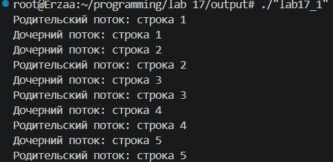

# Лабораторная 17

---

## Задание 1. Создание потока

## Задание 2. Ожидание потока

## Задание 3. Параметры потока

## Задание 4. Завершение нити без ожидания

## Задание 5. Обработать завершение потока

## Задание 6. Реализовать простой Sleepsort

 
